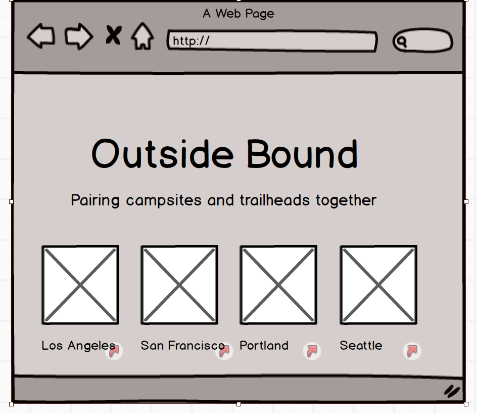
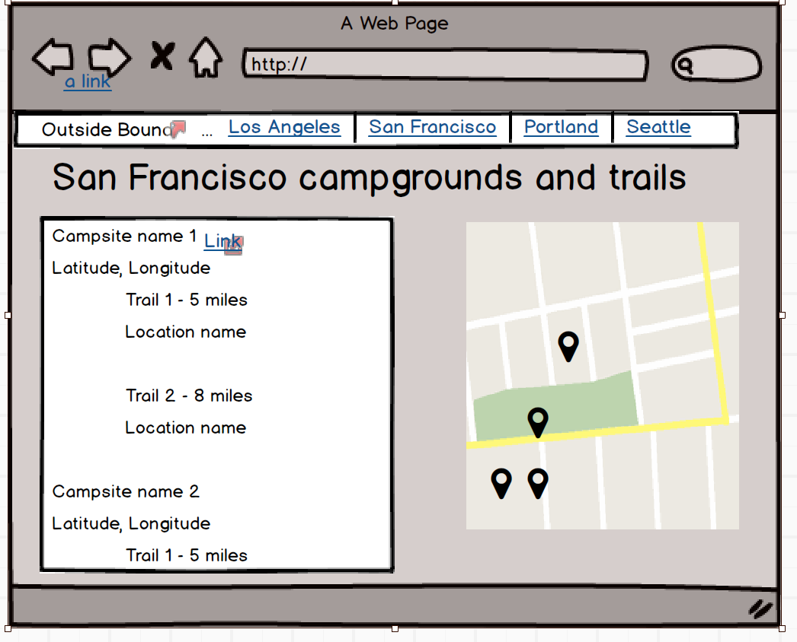

# Outside Bound

Outside Bound matches campgrounds with nearby hiking trails. Users can plan a weekend camping getaway with ease, and discover new trails nearby.

## Link to Heroku-hosted site
[https://outside-bound.herokuapp.com](https://outside-bound.herokuapp.com)

## Features
* Users can click on a city and see a list of nearby campsites and trails
* Under each campsite is a list of the top 3 closest trails
* Each campsite has a link to a page at [Reserve America](http://reserveamerica.com)
* Each Trail has a link to get more information at [Every Trail](http://everytrail.com)
* All campsites near each city are displayed on a map
* Trails near campsites also appear on the map

## Technologies used

* Javascript
* jQuery
* Backbone
* Underscore
* Reserveamerica API
* Everytrail API
* Elasticsearch
* Amazon Elasticsearch Service
* Mapbox
* Cheerio

## Future plans
* Adding more cities
* Provide a search box to search by location

## Installation
* Clone Git repo
* `npm install`
* Obtain access key and secret key for ReserveAmerica and EveryTrail
* Obtain write access to an Elasticsearch endpoint
* Configure `.env` file:

``` 
EVERYTRAIL_KEY=abc123abc123
EVERYTRAIL_SECRET=abc123abc123
RESERVEAMERICA_KEY=abc123abc123
ELASTICSEARCH_URL=http://elasticsearch.example.com/endpoint
```

* Seed trail and campsite data into Elasticsearch:

```
node indextrails.js
node indexallcampgrounds.js
```

* `npm run start`

## Wireframes


